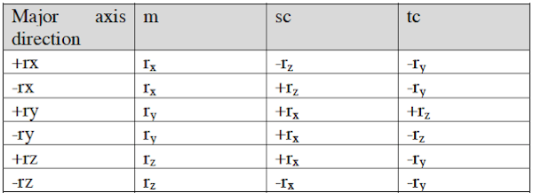

## EquiRectangular to Vertical Cross Cubemap

<br />
<br />

Instead of converting an EquiRectangular projection of a scene to a cubemap texture make up of six 2D textures, we explore the possibilty of directly rendering a vertical crossmap cubemap texture from the 2:1 EquiRectangular texture.

Since a vertical cross cubemap can be rendered from an ordinary (six 2D) cubemap texture, we can use the idea of deriving a pair of texture coordinates for a given face.

Referring to the Rendermann specifications:



<br />
<br />

to access one of the six 2D textures of the cubemap, we need to form a 3D vector. So, if we know which face of the cubemap is to be accessed, we can just setup the vector using the Lookup table above as a guide.

As an example, if we want to access the pixels of the **+X** face, the 3D vector should be:

```metal

    float3 direction = float3(1.0, -tc, -sc);
    
```

where sc and tc are texture coordinates that are mapped to the texture coordinates of a pixel of the corresponding face of the 2D Vertical Cross cubemap. If you read Paul Reed's article, you use any mapping scheme (cf **Cubemap Layout** section of the webpage). The 2 important things to note is:

a) how to map a pixel's texture coordinates in a particular output cubemap layout (e.g. vertical cross) to a face of a cube, and,

b) normalization of the 3D direction vector.

<br />
<br />

We have chosen the time-tested method by mapping a pixel of the output image to a cube of 2 units. Note: the 3D vector must be normalized inside the if branch:

```metal

    if (dir.x != 0.0 && dir.y != 0.0) {
        dir = normalize(dir);
        ...
        ...
    }

```

<br />
<br />

**Further Observations**
<br />

a) To save the generated cross cubemap, perform an offscreen rendering to a texture. Once the texture is available, certain methods of macOS' CIImage and CGImage classes can be used. (Refer to the *Cubemap2EquiRect* demo of the *MetalCubemapping* Project.)

b) Texturing a sphere is similar to texturing a cube since a 3D vector from the centre of the sphere to a point on its surface can be expressed in spherical coordinates.

c) There is now enough information to write a bare-bones Cubemap Generator. The best input format may be an EquiRectangular Projection map.

<br />
<br />

**Reference**

To perform a render into an offscreen texture, please refer to Apple's Sample Code: **"Customizing Render Pass Setup"**.

<br />

**Requirements:** 
<br />

XCode 9.x, Swift 4.x and macOS 10.13.4 or later.

<br />
<br />


**Web Links:**


https://cgvr.cs.uni-bremen.de/teaching/cg_literatur/Cube_map_tutorial/cube_map.html


http://paul-reed.co.uk/programming.html


https://gpuopen.com/archived/cubemapgen/
